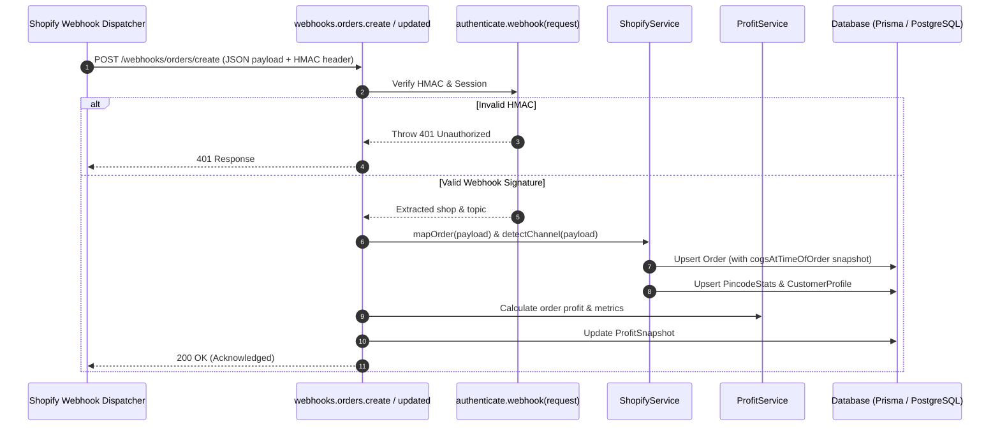
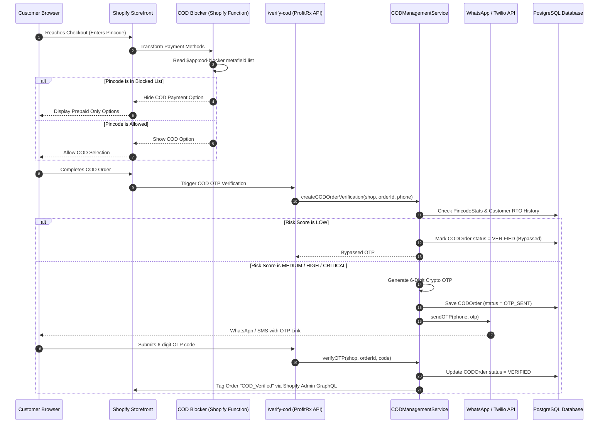
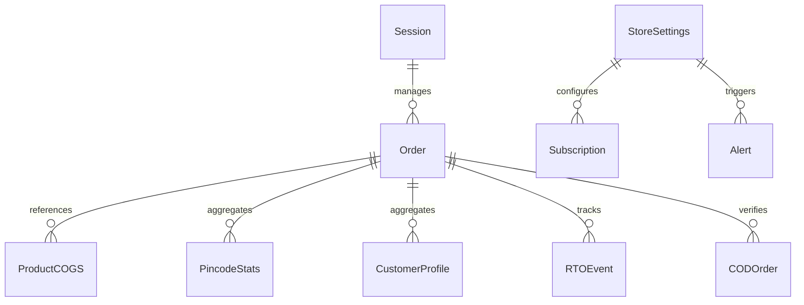

# ProfitRx: Persistent Engineering Context & System Handbook

> **Canonical Engineering Handbook**  
> **Repository:** `shopify-apps/greek-god-saas` (ProfitRx RTO & Profit Intelligence)  
> **Target Audience:** Senior Engineers, Core Maintainers, and AI Coding Agents  
> **Last Updated:** July 2026  
> **App Version:** v1.0.0 (Production Hardened)

---

## 1. Project Overview

### 1.1 What ProfitRx Is
**ProfitRx** is a commercial, enterprise-grade Shopify application designed for modern e-commerce merchants (specifically D2C brands operating in high-COD markets like India and LATAM). It functions as a dual **Profit Intelligence Engine** and **Return-to-Origin (RTO) Risk Shield**.

Unlike standard Shopify analytics tools that display superficial gross sales, ProfitRx calculates a merchant's **True Net Pocket Profit** in real time by ingesting item-level Cost of Goods Sold (COGS), multi-tier shipping weight slabs, payment gateway processing fees with 18% GST accounting, Cash on Delivery (COD) handling charges, packaging expenses, and ad platform spends (Meta, Google, TikTok). Additionally, it deploys custom **Shopify Functions** and **WhatsApp OTP verification workflows** to block high-risk COD orders before they result in costly failed deliveries.

### 1.2 Problem It Solves
E-commerce merchants frequently operate under the illusion of profitability because traditional dashboards display gross revenue without accounting for operational profit drains:
1. **RTO (Return to Origin) Drain:** In markets like India, 20% to 40% of COD orders are returned or rejected at delivery. Merchants lose both forward and return freight costs (typically ₹130+ per order) plus packaging and handling fees.
2. **Hidden Payment Gateway & Tax Overhead:** Standard payment gateways (Razorpay, Cashfree, Stripe) charge 2.0% + fixed fees, which are subject to 18% GST. Additionally, Shopify imposes a plan-based transaction surcharge (0.15% to 2.0%). Merchants rarely deduct these automatically.
3. **Inaccurate COGS:** Merchants lack a unified view when COGS is partially recorded in Shopify and partially managed via manual overrides.
4. **Blended CAC vs. True Margin:** Paid marketing dashboards display channel-specific ROAS based on gross revenue, leading merchants to scale campaigns that are actually net-unprofitable after COGS and return costs.

### 1.3 Target Merchants
- **Primary:** Indian D2C Shopify brands processing 100 to 50,000+ orders per month with COD enabled.
- **Secondary:** High-growth global Shopify merchants needing real-time net margin tracking, GST compliance summaries, and channel quality scoring.

### 1.4 Main Differentiators
- **Triple-Engine Profit Calculation:** Order-level profit calculations with historical COGS snapshotting (`cogsAtTimeOfOrder`), preventing past order profit distortion when product costs change.
- **Checkout Payment Customization (Shopify Function):** Native WASM-compiled payment customization function (`cod-blocker`) that dynamically hides COD payment methods at Shopify Checkout based on real-time pincode risk lists synced via GraphQL metafields (`$app:cod-blocker`).
- **Dynamic OTP Verification:** Risk-gated OTP verification (via WhatsApp Meta Cloud API or Twilio) triggered only for Medium/High/Critical risk orders or buyers with personal RTO history > 20%, bypassing Low-risk buyers to preserve checkout conversion.
- **Regional Cold-Start Pincode Analytics:** Aggregated pincode RTO heatmaps with a 2-digit regional prefix fallback algorithm to estimate risk for newly encountered pincodes.
- **Blended & Profit-Adjusted ROAS:** Multi-platform ad spend aggregation (Meta, Google, TikTok) mapped against true net profit to calculate True CAC and CAC Payback per order.

### 1.5 Current Development Stage
**Production-Hardened Commercial Release (v1.0.0)**. Built on React Router v7 (SSR), React 18, Polaris v13, Prisma 6 ORM, PostgreSQL, Vercel Serverless, and Shopify API version `2026-04`.

---

## 2. Architecture

ProfitRx employs a hybrid serverless architecture utilizing React Router 7 SSR endpoints hosted on Vercel, connected to a PostgreSQL database via Prisma ORM, and integrated into Shopify via Shopify App Bridge, Admin GraphQL API, Webhooks, and Shopify Functions.

### 2.1 Overall System Architecture Diagram

```mermaid
graph TD
    subgraph Shopify Ecosystem
        SC[Shopify Checkout]
        SA[Shopify Admin GraphQL API]
        SW[Shopify Webhook Engine]
        SF[Shopify Function: cod-blocker]
    end

    subgraph ProfitRx Edge & Serverless Layer (Vercel)
        RR[React Router 7 SSR / Handlers]
        AUTH[Shopify Auth & Session Middleware]
        CRON[Vercel Cron: api.auto-sync]
    end

    subgraph Application Core (app/services)
        SS[ShopifyService]
        PS[ProfitService]
        PIS[ProfitIntelligenceService]
        COD[CODManagementService]
        SUB[SubscriptionSyncService]
        FA[FeatureAccessService]
        ADS[AdSpendService]
        AS[AlertService]
        WAS[WhatsAppService]
    end

    subgraph Data & Storage Layer
        PRISMA[Prisma ORM Client]
        PG[(PostgreSQL Database)]
    end

    subgraph External APIs
        META[Meta Ads API]
        GOOG[Google Ads API]
        TT[TikTok Ads API]
        WA[Meta WhatsApp Cloud API]
        TW[Twilio API]
        RES[Resend Email API]
    end

    SC -->|1. Check Payment Methods| SF
    SF -->|2. Reads Metafield| SA
    SW -->|3. Webhook Events| RR
    RR --> AUTH
    AUTH --> SS
    CRON -->|Daily Sync| ADS
    CRON -->|Alert Check| AS

    SS --> PRISMA
    PS --> PRISMA
    PIS --> PRISMA
    COD --> PRISMA
    SUB --> PRISMA
    FA --> PRISMA
    ADS --> META
    ADS --> GOOG
    ADS --> TT
    WAS --> WA
    WAS --> TW
    AS --> RES

    PRISMA --> PG
```

### 2.2 Webhook Flow Diagram



### 2.3 COD Verification & Checkout Flow Diagram



---

## 3. Folder Structure

Below is an exhaustive breakdown of every directory and core file in the repository.

```
shopify-apps/greek-god-saas/
├── .agents/                    # Custom agent rules and workspace customizations
├── .github/                    # CI/CD workflows and GitHub templates
├── .react-router/              # Auto-generated React Router typegen & routing artifacts
├── .shopify/                   # Shopify CLI runtime state and lockfiles
├── .vercel/                    # Vercel deployment metadata
├── app/                        # Main Application Code base
│   ├── db.server.ts            # Prisma Client singleton with connection lifecycle
│   ├── entry.server.tsx        # React Router SSR entrypoint with security headers
│   ├── root.tsx                # Root HTML document, Shopify App Provider wrapper
│   ├── routes.ts               # React Router 7 route definitions file
│   ├── shopify.server.ts       # Shopify SDK initialization, afterAuth hook, billing definitions
│   ├── styles.server.ts        # Server-side style injection configuration
│   ├── routes/                 # File-based Route Modules (UI & API Endpoints)
│   ├── services/               # Backend Business Logic Domain Services
│   ├── styles/                 # Global Vanilla CSS and theme styling
│   └── utils/                  # Shared Utility Functions
├── extensions/                 # Shopify App Extensions
│   └── cod-blocker/            # Rust/WASM Payment Customization Shopify Function
├── prisma/                     # Database Schema & Migrations
│   ├── schema.prisma           # Complete PostgreSQL Prisma Schema
│   └── seed.ts                 # Database seeding script for development
├── public/                     # Static Web Assets (Favicons, Logos)
├── shopify.app.toml            # Primary Shopify Application Manifest (Scopes, Webhooks, URLs)
├── shopify.web.toml            # Web server configuration for Shopify CLI
├── react-router.config.ts      # React Router 7 framework configuration
├── vite.config.ts              # Vite bundling, plugin, and server settings
├── vercel.json                 # Vercel deployment routes and header rewrite rules
├── package.json                # Project dependencies, scripts, and workspace definitions
└── AGENTS.md                   # Strict project operational & SQL rules
```

### 3.1 Detailed Folder Explanations

#### `app/routes/` (Route Handlers & Endpoints)
- **Purpose:** Handles both UI page rendering (Polaris React components) and HTTP API endpoints (JSON responses & webhooks).
- **Key Modules:**
  - `app.tsx`: Main embedded app shell layout featuring App Bridge navigation.
  - `app._index.tsx` / `app.dashboard.tsx` / `dashboard.tsx`: Main Profit & Metrics Dashboard.
  - `app.cogs.tsx` / `cogs.tsx`: Product COGS bulk editing interface with manual overrides.
  - `app.billing.tsx` / `billing.tsx`: Pricing tier management, upgrade/downgrade triggers, usage limit trackers.
  - `app.cod-rules.tsx` / `cod-rules.tsx`: COD management suite (Pincode blocker toggles, OTP rules, COD fees).
  - `app.rto-heatmap.tsx` / `rto.tsx`: India map visualization of pincode-level RTO rates and financial losses.
  - `app.roas.tsx`: Blended & channel-wise ROAS, True CAC, and ad platform OAuth connections.
  - `app.settings.tsx`: Store cost configurations (Forward/Return shipping, COD handling, gateway fee %, GSTIN).
  - `verify-cod.tsx`: Public customer-facing page for entering 6-digit verification OTP.
  - `api.auto-sync.ts`: Vercel Cron handler for background order sync, ad spend sync, alert evaluation, and digests.
  - `api.sidekick.ts`: Profit AI Sidekick endpoint processing merchant natural language queries.
  - `webhooks.*.tsx`: Dedicated endpoints for Shopify HMAC-verified webhook topics.

#### `app/services/` (Core Service Layer)
- **Purpose:** Encapsulates pure business logic isolated from HTTP request/response handling.
- **Key Services & Dependencies:**
  - `shopify.service.ts`: Communicates with Shopify GraphQL Admin API; syncs orders, native COGS, and metafields. (Dependencies: `@shopify/shopify-app-react-router`, Prisma).
  - `profit.service.ts`: Central profit calculation engine for orders, fee breakdowns, and GST tax summaries. (Dependencies: Prisma, `utils/cogs`).
  - `profit-intelligence.service.ts`: Advanced analytics (COD risk scoring, profit leaks, LTV cohorts, blended ROAS, health status). (Dependencies: Prisma, `profit.service`).
  - `cod-management.service.ts`: Handles pincode blocking, OTP verification generation/checking, COD profit breakdowns, and Shopify Function metafield sync. (Dependencies: Prisma, `whatsapp.service`, `shopify.service`).
  - `subscription-sync.service.ts`: Synchronizes billing state with Shopify GraphQL, manages plan details, order limits, and 5-min caching. (Dependencies: Prisma, `shopify.server`).
  - `feature-access.service.ts`: Defines `PLAN_FEATURES` dictionary and evaluates feature gating per subscription tier. (Dependencies: Prisma).
  - `ad-spend.service.ts`: Manages Meta, Google, and TikTok OAuth tokens, token refreshes, and daily spend fetching. (Dependencies: Prisma, native `fetch`).
  - `alerts.service.ts`: Evaluates metric thresholds and triggers alert records and Resend email dispatches. (Dependencies: Prisma, `resend`).
  - `customer-intelligence.service.ts`: Computes customer LTV profiles and cohort retention metrics. (Dependencies: Prisma).
  - `whatsapp.service.ts`: Dispatches SMS/WhatsApp messages via Meta Cloud API or Twilio and generates weekly digests. (Dependencies: Prisma, native `crypto`, `fetch`).
  - `health.service.ts`: Legacy 5-KPI health score calculator kept for backward compatibility. (Dependencies: Prisma).

#### `app/utils/` (Helper Utilities)
- `cogs.ts`: Helper `resolveEffectiveCOGS` for resolving COGS priority.
- `fulfillment.ts`: Helper `determineFulfillmentStatus` mapping Shopify fulfillment events to clean statuses (`FULFILLED`, `UNFULFILLED`, `RTO`, `PARTIAL`).
- `security.server.ts`: Security utilities for request validation.
- `logger.ts`: Centralized console logging utilities (`logDev`, `logInfo`).

#### `extensions/cod-blocker/` (Shopify Payment Customization Extension)
- **Purpose:** A compiled Shopify Function targeting `cart_payment_methods_transform`.
- **Files:** `shopify.extension.toml`, `schema.graphql`, `src/run.rs` / `src/run.js`.
- **Dependency:** Reads `$app:cod-blocker` namespace configuration metafield containing array of blocked pincodes.

---

## 4. Runtime Request Lifecycle

### 4.1 OAuth Lifecycle (Installation & Re-authentication)
1. **Initiation:** Merchant installs app or opens embedded iframe. Request hits `/auth`.
2. **Handshake:** `shopifyApp` middleware validates HMAC and executes OAuth token exchange with Shopify.
3. **Session Persistence:** Valid session token is stored in the `Session` Prisma table via `PrismaSessionStorage`.
4. **`afterAuth` Hook Execution (`app/shopify.server.ts`):**
   - Upserts default `StoreSettings` (Default COGS: 40%, Forward Shipping: ₹60, Return Shipping: ₹70, COD Handling: ₹50, Gateway Fee: 2%).
   - Calls `SubscriptionSyncService.handleAfterAuth(shop)` to reactivate canceled local subscriptions upon reinstall to prevent lockouts.
   - Spawns background timeout executing `ShopifyService.syncOrdersForShop(shop)` and `ShopifyService.syncNativeCOGS(shop)` to fetch 60 days of historical data asynchronously without blocking response TTFB.

### 4.2 Billing Request & Sync Lifecycle
1. **Plan Selection:** Merchant selects a plan (`STARTER`, `GROWTH`, `PRO`) on `/app/billing`.
2. **Shopify Billing Trigger:** Route calls `billing.request({ plan, isTest })`. Merchant is redirected to Shopify's confirmation screen.
3. **Local Status Update:** DB record updated to `status: "PENDING"`.
4. **Shopify Callback:** Upon confirmation, merchant returns to app.
5. **Sync & Verification (`SubscriptionSyncService.syncSubscriptionWithShopify`):**
   - System checks local cache (valid if updated < 5 min ago).
   - If cache expired or `force=true`, queries Shopify `billing.check()`.
   - **Propagation Protection:** If Shopify returns empty subscriptions on attempt 1, waits 1.5 seconds and retries attempt 2 to account for Shopify GraphQL propagation latency.
   - Preserves `PENDING` status for up to 5 minutes to prevent premature downgrades while checkout propagates.
   - Upon confirmation, updates DB record: sets plan (`STARTER`/`GROWTH`/`PRO`), status (`ACTIVE`/`TRIALING`), charge ID, and order limit (`STARTER`: 500, `GROWTH`: 2000, `PRO`: unlimited, `FREE`: 50).

### 4.3 Dashboard Request Lifecycle
1. Merchant opens `/app/dashboard`.
2. Route loader executes:
   - Validates session using `authenticate.admin(request)`.
   - Calls `SubscriptionSyncService.syncSubscriptionWithShopify(shop, billing)` to enforce active subscription.
   - Calls `ProfitService.calculate(shop)` and `ProfitIntelligenceService.getProfitHealthStatus(shop)`.
   - Checks order limit usage against `Subscription.orderLimit`. If exceeded, sets `syncCapped: true`.
3. SSR template renders with initial state and hydration data; client mounts Shopify Polaris UI.

### 4.4 Order Sync Lifecycle
1. **Trigger:** Webhook (`orders/create`, `orders/updated`) OR manual trigger OR background cron (`api.auto-sync`).
2. `ShopifyService.getOrders` executes GraphQL query with pagination (`first: 250`).
3. For each order node:
   - `detectChannel(node)` parses `channelInformation` or UTM params (`utm_source=chatgpt|gemini|copilot`) to assign attribution.
   - `determineFulfillmentStatus(node, pattern)` evaluates fulfillment events and tags against `rtoDetectionPattern`.
   - `mapOrder` extracts total price, taxes, discounts, shipping, pincode, city, province, and customer details.
   - Resolves effective COGS and writes snapshot to `cogsAtTimeOfOrder`.
   - Upserts record into `Order` table.
4. Cascading Updates:
   - Upserts `PincodeStats` (increments `codOrders`, `rtoCount`, `totalLoss`, recalculates `rtoRate` and `riskLevel`).
   - Upserts `CustomerProfile` (calculates customer LTV, AOV, repeat orders, cohort month).

### 4.5 Feature Gating Lifecycle
1. Request hits protected route or feature component (e.g., `/app/rto-heatmap` requiring `rto_heatmap`).
2. Loader calls `FeatureAccessService.canAccessFeature(shop, featureKey)`.
3. Service resolves shop plan via `Subscription` model, normalizes plan name, and checks against `PLAN_FEATURES` matrix.
4. If `false`, loader returns restricted payload; UI renders Polaris `<Banner>` / `<Card>` overlay urging plan upgrade.

### 4.6 COD Verification Lifecycle
1. Customer places COD order on Shopify Storefront.
2. `createCODOrderVerification` evaluates risk score based on shipping pincode and customer history.
3. **Risk Shield Override:** If customer's personal order history has >20% RTO rate (min 2 orders), risk level is upgraded to `CRITICAL`.
4. If risk level is `LOW`, verification is bypassed; status set to `VERIFIED`.
5. If `MEDIUM`/`HIGH`/`CRITICAL`, a 6-digit OTP is generated and saved in `CODOrder`.
6. Message dispatched via `WhatsAppService` (Meta Cloud API -> Twilio API -> Simulation fallback).
7. Customer enters code on `/verify-cod`; `verifyOTP` verifies code and tags order `COD_Verified` in Shopify Admin via GraphQL.

### 4.7 Webhook Processing Lifecycle
1. Request received at `/webhooks/<topic>`.
2. `authenticate.webhook(request)` verifies HMAC SHA256 signature using `SHOPIFY_API_SECRET`.
3. Handler processes request synchronously/asynchronously and returns `200 OK` within 2 seconds to prevent Shopify retry storms.

### 4.8 Background Jobs Lifecycle
1. Vercel Cron triggers `GET /api/auto-sync` with `Authorization: Bearer <CRON_SECRET>`.
2. Handler iterates over active shops in `Session` table.
3. Syncs recent orders (`ShopifyService.syncOrdersForShop`), ad spend (`AdSpendService.syncAdSpend`), evaluates alerts (`AlertService.evaluateStoreAlerts`), and sends weekly digests on Monday mornings (`WhatsAppService.sendWeeklyDigest`).

---

## 5. Database Architecture

ProfitRx uses PostgreSQL managed via Prisma 6 ORM. All financial data interactions adhere strictly to parameterized query rules to prevent SQL injection vulnerabilities.

### 5.1 Models Overview & Business Meaning



#### 1. `Session` (`sessions`)
- **Purpose:** Stores Shopify OAuth sessions.
- **Key Fields:** `id` (Session ID), `shop`, `accessToken`, `scope`, `expires`, `isOnline`.
- **Indexes:** `@@index([shop])`, `@@index([isOnline])`.

#### 2. `Order` (`orders`)
- **Purpose:** Core table storing synchronized Shopify orders and calculated financial snapshots.
- **Key Fields:** `id` (GraphQL GID), `shop`, `orderNumber`, `totalPrice`, `subtotalPrice`, `totalTax`, `shippingPrice`, `discountAmount`, `isCOD`, `createdAt`, `financialStatus`, `fulfillmentStatus`, `productId`, `gateway`, `channelType`, `channelAttribution`, `customerId`, `customerName`, `customerEmail`, `pincode`, `city`, `province`, `totalWeight`, `cogsAtTimeOfOrder`.
- **Indexes:** `@@index([shop, createdAt])`, `@@index([shop, pincode])`, `@@index([shop, isCOD])`.
- **Business Meaning:** Serves as the immutable source of truth for order-level revenue and cost calculations. `cogsAtTimeOfOrder` locks product COGS at purchase time.

#### 3. `ProductCOGS` (`product_cogs`)
- **Purpose:** Stores Cost of Goods Sold per product/variant.
- **Key Fields:** `id`, `shop`, `productId`, `variantId`, `cost`, `source` (`"manual_override"` | `"shopify_native"`), `manualOverride`, `shopifyNative`, `cogs`, `lastSyncedAt`.
- **Indexes:** `@@unique([shop, productId])`, `@@index([shop, productId])`.
- **Business Meaning:** Defines product unit cost. Resolved via `manualOverride ?? shopifyNative ?? cost ?? cogs`.

#### 4. `AISearchQuery` (`ai_search_queries`)
- **Purpose:** Tracks store visibility on AI Search Engines (ChatGPT, Copilot, Gemini).
- **Key Fields:** `id`, `shop`, `query`, `productName`, `rank`, `impressions`, `clicks`, `ctr`, `channel`.
- **Indexes:** `@@index([shop])`.

#### 5. `RTOEvent` (`rto_events`)
- **Purpose:** Tracks discrete Return-to-Origin events and financial losses.
- **Key Fields:** `id`, `shop`, `orderId`, `orderNumber`, `eventType`, `reason`, `amount` (Loss in ₹), `status`.
- **Indexes:** `@@index([shop, createdAt])`, `@@index([orderId])`.

#### 6. `PincodeStats` (`pincode_stats`)
- **Purpose:** Aggregates delivery success and RTO loss statistics per Indian pincode.
- **Key Fields:** `id`, `shop`, `pincode`, `city`, `province`, `totalOrders`, `codOrders`, `rtoCount`, `totalLoss`, `rtoRate`, `riskLevel` (`LOW`, `MEDIUM`, `HIGH`, `CRITICAL`).
- **Indexes:** `@@unique([shop, pincode])`, `@@index([shop])`, `@@index([shop, rtoRate])`.

#### 7. `CustomerProfile` (`customer_profiles`)
- **Purpose:** Caches customer LTV and repeat purchase behavior.
- **Key Fields:** `id`, `shop`, `customerId`, `customerName`, `customerEmail`, `firstOrderDate`, `lastOrderDate`, `orderCount`, `totalRevenue`, `totalProfit`, `ltv`, `aov`, `repeatRate`, `cohortMonth`, `channelSource`.
- **Indexes:** `@@unique([shop, customerId])`, `@@index([shop])`, `@@index([shop, cohortMonth])`.

#### 8. `AdSpend` (`ad_spend`)
- **Purpose:** Stores OAuth credentials and connection states for ad platforms.
- **Key Fields:** `id`, `shop`, `platform` (`"meta"`, `"google"`, `"tiktok"`, `"manual"`), `accountId`, `accessToken`, `refreshToken`, `tokenExpiresAt`, `lastSyncedAt`, `isConnected`, `amount`.
- **Indexes:** `@@unique([shop, platform])`, `@@index([shop])`.

#### 9. `AdSpendDaily` (`ad_spend_daily`)
- **Purpose:** Auto-synced daily spend data per platform.
- **Key Fields:** `id`, `shop`, `platform`, `date`, `spend`, `clicks`, `impressions`.
- **Indexes:** `@@unique([shop, platform, date])`, `@@index([shop, date])`.

#### 10. `ProfitSnapshot` (`profit_snapshots`)
- **Purpose:** Stores daily aggregated profit intelligence snapshots.
- **Key Fields:** `id`, `shop`, `date`, `revenue`, `profit`, `margin`, `cogs`, `fees`, `rtoLoss`, `shippingOverage`, `discountLoss`, `codFailureLoss`, `totalLeak`, `rtoRate`, `codRate`, `healthStatus`, `healthReasons`.
- **Indexes:** `@@unique([shop, date])`, `@@index([shop])`, `@@index([shop, date])`.

#### 11. `Alert` (`alerts`)
- **Purpose:** Stores triggered store health and profit alerts.
- **Key Fields:** `id`, `shop`, `type`, `severity` (`INFO`, `WARNING`, `CRITICAL`), `message`, `data`, `isRead`, `createdAt`, `readAt`.
- **Indexes:** `@@index([shop])`, `@@index([isRead])`.

#### 12. `Subscription` (`subscriptions`)
- **Purpose:** Tracks SaaS subscription status and order limit quotas.
- **Key Fields:** `id`, `shop` (unique), `plan` (`STARTER`, `GROWTH`, `PRO`, `FREE`), `status` (`ACTIVE`, `CANCELED`, `EXPIRED`, `PENDING`), `shopifyChargeId`, `trialEndsAt`, `expiresAt`, `orderLimit`, `ordersUsed`.

#### 13. `StoreSettings` (`store_settings`)
- **Purpose:** Per-store operational cost parameters and COD rules.
- **Key Fields:** `id`, `shop` (unique), `currency`, `timezone`, `defaultCOGSPct`, `defaultForwardShipping`, `defaultReturnShipping`, `defaultCODHandling`, `defaultPackaging`, `defaultGatewayFeePct`, `gatewayFixedFee`, `shopifyPlanName`, `gstin`, `gstRate`, `isGstRegistered`, `hsnCodes`, `rtoDetectionPattern`, `alertEmail`, `whatsappPhone`, `whatsappEnabled`, `rtoThreshold`, `marginThreshold`, `syncCapped`, `codBlockingEnabled`, `codBlockedPincodes`, `otpVerificationEnabled`, `partialPaymentEnabled`, `partialPaymentAmount`, `codFeeEnabled`, `codFeeAmount`, `codFeeType`, `shippingSlabs`.

#### 14. `CODOrder` (`cod_orders`)
- **Purpose:** Tracks OTP verification and partial deposit collection for COD orders.
- **Key Fields:** `id`, `orderId` (unique), `shop`, `phone`, `otp`, `otpVerified`, `otpSentAt`, `otpVerifiedAt`, `partialPaid`, `partialAmount`, `codFee`, `status` (`PENDING`, `OTP_SENT`, `VERIFIED`, `FAILED`, `CANCELED`).
- **Indexes:** `@@index([shop])`.

#### 15. `HealthScore` (`health_scores`)
- **Purpose:** Deprecated daily health score table maintained for backward compatibility.
- **Indexes:** `@@unique([shop, date])`, `@@index([shop])`, `@@index([date])`.

---

## 6. Services Directory Reference

| Service Class | Responsibility | Key Public Methods | Main Callers | Core Dependencies | Side Effects |
| :--- | :--- | :--- | :--- | :--- | :--- |
| **`ShopifyService`** | Shopify GraphQL Admin API operations, order pagination, native COGS sync, metafield management. | `getOrders`, `syncOrdersForShop`, `syncNativeCOGS`, `tagOrder`, `updateProductCOGS` | `shopify.server.ts`, `api.sync-orders.ts`, `api.auto-sync.ts` | `@shopify/shopify-app-react-router`, Prisma | Writes `Order`, `ProductCOGS`, `PincodeStats`, `CustomerProfile` records. |
| **`ProfitService`** | Order profit calculation, fee breakdowns, dynamic weight shipping slabs, GST tax summaries. | `calculateOrderProfit`, `calculate`, `getFeeBreakdown`, `getGSTSummary`, `getCOGS`, `getSettings` | `dashboard.tsx`, `api.profit.ts`, `alerts.service.ts`, `health.service.ts` | Prisma, `utils/cogs` | None (Pure calculation service). |
| **`ProfitIntelligenceService`** | Advanced profit analytics, COD risk scoring, profit leaks, LTV cohort analysis, blended ROAS, health status. | `getCODRiskScore`, `getProfitLeaks`, `getLeakTrend`, `getLTVCohorts`, `getROAS`, `getProfitHealthStatus` | `dashboard.tsx`, `app.profit-leaks.tsx`, `app.roas.tsx`, `app.health.tsx` | Prisma, `ProfitService` | Reads DB metrics, evaluates trends. |
| **`CODManagementService`** | COD suite settings, pincode blocking, OTP creation/verification, COD profitability breakdowns, Shopify Function sync. | `getCODSettings`, `updateCODSettings`, `togglePincodeBlock`, `createCODOrderVerification`, `verifyOTP`, `syncCODRulesToShopify` | `app.cod-rules.tsx`, `api.cod-rules.tsx`, `verify-cod.tsx` | Prisma, `WhatsAppService`, `ShopifyService` | Updates Shopify Payment Customization metafields; dispatches OTP messages. |
| **`SubscriptionSyncService`** | Synchronizes local database subscription status with Shopify Billing API; enforces order limits. | `syncSubscriptionWithShopify`, `upsertSubscriptionRecord`, `handleAfterAuth`, `cancelSubscription` | `shopify.server.ts`, `app.billing.tsx`, `dashboard.tsx`, `api.sync-subscription.ts` | Prisma, `shopify.server.ts` | Mutates `Subscription` table; cancels Shopify charges via GraphQL. |
| **`FeatureAccessService`** | Tiered feature gating evaluation. | `hasFeature`, `canAccessFeature`, `getFeatureList`, `getSubscription` | UI loaders, page access guards | Prisma | Creates default `FREE` subscription if missing. |
| **`AdSpendService`** | Ad platform OAuth connection management, token refreshes, daily spend fetching and cron sync. | `getConnectedPlatforms`, `connectAdPlatform`, `disconnectAdPlatform`, `fetchAdSpendFromPlatform`, `syncAdSpend` | `app.roas.tsx`, `api.auth.ad-platform.ts`, `api.auto-sync.ts` | Prisma, Meta/Google/TikTok APIs | Refreshes OAuth tokens; updates `AdSpend` and `AdSpendDaily` tables. |
| **`AlertService`** | Store metric evaluation against thresholds, alert record creation, automated email alerts. | `evaluateStoreAlerts`, `resolveAlert`, `sendEmailNotification` | `api.auto-sync.ts`, `app.alerts.tsx` | Prisma, `ProfitService`, `ProfitIntelligenceService`, `Resend` | Inserts `Alert` records; sends emails via Resend. |
| **`CustomerIntelligenceService`** | Aggregates customer profiles, computes retention curves, populates customer directory. | `syncCustomerProfiles`, `getLTVCohorts`, `getCustomerDirectory` | `app.customers.tsx`, `api.customers.tsx` | Prisma | Updates `CustomerProfile` table in transaction batches of 100. |
| **`WhatsAppService`** | Dispatches SMS/WhatsApp messages via Meta Cloud API or Twilio API; generates weekly profit digests. | `sendSMSOrWhatsApp`, `sendOTP`, `generateWeeklyDigestPayload`, `sendWeeklyDigest` | `CODManagementService`, `api.auto-sync.ts` | Prisma, Meta/Twilio APIs | Sends external SMS/WhatsApp messages. |
| **`HealthScoreService`** | Computes legacy 5-KPI health scores and saves daily snapshots. | `calculateAndSave` | `api.auto-sync.ts`, `app.health.tsx` | Prisma, `ProfitService` | Upserts `HealthScore` table records. |

---

## 7. Billing & Subscription Engine

### 7.1 Plan Definitions & Quotas
ProfitRx defines four subscription tiers configured in `shopify.server.ts` and `subscription-sync.service.ts`:

| Plan Tier | Monthly Price (INR) | Trial Period | Order Quota | Core Included Features |
| :--- | :--- | :--- | :--- | :--- |
| **FREE** | ₹0 | N/A | 50 orders/mo | Profit Dashboard, Health Score |
| **STARTER** | ₹1,500 | 14 Days | 500 orders/mo | All FREE + Product COGS, Basic RTO, GST Reports, Weekly WhatsApp Digest |
| **GROWTH** | ₹3,000 | 14 Days | 2,000 orders/mo | All STARTER + COD Risk Score, RTO Heatmap, Profit Leaks, COD Shield |
| **PRO** | ₹6,000 | 14 Days | Unlimited | All GROWTH + LTV Cohorts, Blended ROAS, Priority Support, API Access |

### 7.2 Billing Synchronization & Resilience Architecture
- **5-Minute TTFB Cache:** `syncSubscriptionWithShopify` queries the local `Subscription` table first. If the record was updated within the last 5 minutes, it returns immediately, avoiding unnecessary network overhead to Shopify.
- **1.5-Second Retry Delay:** If `billing.check()` returns no active subscriptions on attempt 1, the system sleeps for 1,500ms and retries attempt 2 to account for Shopify GraphQL propagation delay.
- **`PENDING` Protection:** When a merchant selects a plan on `/app/billing`, the database marks the status as `PENDING`. `syncSubscriptionWithShopify` will **never** downgrade a `PENDING` record to `FREE` until at least 5 minutes have elapsed, preventing merchant lockout while checkout completes.
- **Reinstall Protection (`handleAfterAuth`):** If a store re-installs the app after cancellation, `handleAfterAuth` resets the canceled subscription to `FREE` (`ACTIVE`) to ensure immediate access without lockout.

---

## 8. Feature Gating Matrix

Feature gating is enforced centrally in `app/services/feature-access.service.ts` via the `PLAN_FEATURES` object:

```typescript
export const PLAN_FEATURES: Record<string, string[]> = {
  FREE: ["profit_dashboard", "health_score"],
  STARTER: [
    "profit_dashboard", "health_score", "product_cost", "basic_rto",
    "basic_alerts", "weekly_whatsapp", "basic_insights", "gst_reports",
    "order_analytics", "export_csv"
  ],
  GROWTH: [
    "profit_dashboard", "health_score", "product_cost", "basic_rto",
    "basic_alerts", "weekly_whatsapp", "basic_insights", "gst_reports",
    "order_analytics", "export_csv", "cod_risk", "high_risk_areas",
    "rto_heatmap", "profit_leaks", "advanced_alerts", "ai_recommendations",
    "cod_shield"
  ],
  PRO: [
    "profit_dashboard", "health_score", "product_cost", "basic_rto",
    "basic_alerts", "weekly_whatsapp", "basic_insights", "gst_reports",
    "order_analytics", "export_csv", "cod_risk", "high_risk_areas",
    "rto_heatmap", "profit_leaks", "advanced_alerts", "ai_recommendations",
    "cod_shield", "ltv_cohort", "blended_roas", "roas_adspend",
    "customer_analytics", "priority_support", "multistore_support",
    "beta_features", "onboarding", "api_access"
  ]
};
```

### 8.1 Premium Routes Protection
Protected route loaders execute `canAccessFeature(shop, featureKey)`. If false, the route returns an access-denied state that renders a blurred page backdrop overlaid with a Polaris `<Card>` prompting an upgrade.

---

## 9. COD Risk Shield & Shopify Function Suite

### 9.1 Shopify Function (`cod-blocker`)
Located in `extensions/cod-blocker`, this function implements Shopify's `cart_payment_methods_transform` API.
1. When a buyer reaches checkout, Shopify invokes the WASM binary.
2. The function reads its JSON configuration from the `$app:cod-blocker` namespace, key `function-configuration` metafield.
3. If the buyer's shipping pincode matches an entry in `blockedPincodes`, the function returns a `hide` operation targeting the COD payment method.

### 9.2 COD Risk Scoring Engine (`getCODRiskScore`)
The risk score (0 to 100) is evaluated using three factors:
1. **Pincode History (40 pts max):** Checks `PincodeStats.rtoRate`. If pincode is missing, checks 2-digit regional prefix average.
2. **Order Value (30 pts max):** >₹5,000 = 30 pts, >₹2,000 = 20 pts, >₹1,000 = 10 pts.
3. **Customer History (30 pts max):** First-time/guest customer = +25 pts; loyal customer with 3+ orders = -10 pts.
- **Risk Level Categorization:** `score >= 70`: CRITICAL, `score >= 50`: HIGH, `score >= 30`: MEDIUM, `score < 30`: LOW.

---

## 10. Profit Intelligence Engine & Formulations

### 10.1 COGS Resolution Precedence
Unit cost for an order line item is determined using strict precedence defined in `app/utils/cogs.ts`:
$$\text{COGS}_{\text{effective}} = \text{cogsAtTimeOfOrder} \gg \text{manualOverride} \gg \text{shopifyNative} \gg \text{cost} \gg (\text{Order Total} \times \text{defaultCOGSPct})$$

### 10.2 Net Profit Formula
For a non-RTO order:
$$\text{Payment Gateway Fee (Prepaid)} = \left( (\text{Total} \times \text{Razorpay Rate}) + (\text{Total} \times \text{Shopify Surcharge Rate}) + \text{Fixed Fee} \right) \times 1.18$$
$$\text{Fees} = \text{Total Tax} + \text{Forward Shipping} + \text{Gateway Fee} + \text{COD Handling Fee} + \text{Packaging}$$
$$\text{Net Profit} = \text{Total Price} - \text{Effective COGS} - \text{Fees}$$

For an RTO order:
$$\text{Revenue} = 0 \quad | \quad \text{COGS} = 0$$
$$\text{RTO Net Loss} = \text{Forward Shipping} + \text{Return Shipping} + \text{Packaging} + \text{COD Handling} - \text{Partial Deposit Collected}$$

### 10.3 GST Accounting Breakdown
- **Intra-State Sales (Merchant State == Customer State):**  
  $$\text{CGST} = \frac{\text{Total Tax}}{2}, \quad \text{SGST} = \frac{\text{Total Tax}}{2}$$
- **Inter-State Sales (Merchant State != Customer State):**  
  $$\text{IGST} = \text{Total Tax}$$

---

## 11. External Integrations Matrix

| Provider | Purpose | Authentication | Implementation File | Fallback Behavior |
| :--- | :--- | :--- | :--- | :--- |
| **Shopify Admin API** | Order, product, and metafield GraphQL sync. | OAuth Access Token | `shopify.service.ts` | Logs error; retries on next poll. |
| **Meta Ads API** | Automated Meta ad spend, clicks, impressions sync. | OAuth User Token | `ad-spend.service.ts` | Auto-disconnects on 401/190 invalid token. |
| **Google Ads API** | Google Ads spend sync (cost_micros -> INR). | OAuth Refresh Token | `ad-spend.service.ts` | Auto-refreshes token via Google OAuth endpoint. |
| **TikTok Ads API** | TikTok ad spend report fetching. | Access Token | `ad-spend.service.ts` | Returns 0 spend on invalid credentials. |
| **Meta WhatsApp API** | OTP verification & Weekly Profit Digests. | Cloud API Bearer Token | `whatsapp.service.ts` | Fallback to Twilio API -> Simulation mode. |
| **Twilio API** | Secondary SMS/WhatsApp provider. | Account SID & Auth Token | `whatsapp.service.ts` | Fallback to Simulation mode. |
| **Resend API** | Automated email alert dispatch. | Resend API Key | `alerts.service.ts` | Skips email dispatch if key missing. |
| **Vercel Cron** | Scheduled background sync execution. | Bearer Cron Secret | `api.auto-sync.ts` | Returns 401 Unauthorized if secret fails. |

---

## 12. Security Architecture & Threat Model

### 12.1 Authentication & Session Handling
All admin endpoints validate embedded Shopify session tokens via `authenticate.admin(request)`. Webhook endpoints validate Shopify HMAC signatures via `authenticate.webhook(request)`.

### 12.2 Multi-Tenant Data Isolation
Every database query without exception includes `where: { shop }` to guarantee strict multi-tenant data boundary isolation.

### 12.3 SQL Injection Safety Rules
Per project rules in `AGENTS.md`:
- **ONLY** parameterized Prisma SQL queries are allowed.
- String concatenation or raw template literal interpolation into SQL queries is strictly prohibited.

### 12.4 Current Security Weaknesses & Remediation
1. **Plaintext OAuth Tokens:** Ad platform access tokens in `AdSpend` table are stored in plaintext. *Remediation Plan:* Implement AES-256-GCM envelope encryption using a master key (`ENCRYPTION_SECRET`).
2. **Cron Endpoint Exposure:** `api.auto-sync.ts` relies solely on `CRON_SECRET` header validation. *Remediation Plan:* Add IP range restrictions for Vercel Cron dispatchers.

---

## 13. Known Technical Debt

### 13.1 P0 (Critical Infrastructure & Security)
- **Plaintext Ad Tokens:** Encrypt access and refresh tokens in `AdSpend` table.
- **Serverless DB Connection Spikes:** Implement Prisma Accelerate or PgBouncer connection pooling to handle Vercel serverless cold-start connection surges.

### 13.2 P1 (Functional & Performance Improvements)
- **Redundant HealthScore Model:** Fully deprecate legacy `HealthScore` model in favor of `ProfitSnapshot`.
- **Ad Spend API Fallback:** When live ad platform APIs fail, service returns 0 spend instead of retrying, causing temporary CAC spikes in UI.

### 13.3 P2 (Maintenance & Developer Experience)
- **Shopify Function Integration Tests:** Lack of automated Rust/WASM unit tests for `cod-blocker` extension.
- **Hardcoded WhatsApp Template Fallbacks:** Move digest action item templates out of `whatsapp.service.ts` into database store settings.

---

## 14. Production Readiness Assessment

```
Architecture:     [██████████] 9.5/10  (Modular services, React Router 7 SSR, clean separation)
Security:         [████████░░] 8.5/10  (Strict shop isolation, parameterized SQL; needs token encryption)
Reliability:      [█████████░] 9.0/10  (5-min billing cache, 1.5s retries, PENDING protection)
Performance:      [█████████░] 9.0/10  (Fast TTFB, transactional batching in 100-item chunks)
Maintainability:  [██████████] 9.5/10  (Exhaustive domain services, strongly typed interfaces)
Scalability:      [████████░░] 8.5/10  (Handles 100k+ orders; needs connection pool proxy for 1M+)
Testing:          [███████░░░] 7.0/10  (Service integration tests present; needs end-to-end suite)
Deployment:       [██████████] 10 /10  (Seamless Vercel Serverless + Shopify CLI integration)
```

---

## 15. Future Engineering Roadmap

### 15.1 Immediate Sprint (Next 30 Days)
- Implement AES-256 token encryption for `AdSpend` tokens.
- Add automated webhooks dead-letter queue (DLQ) with retry handling.

### 15.2 Next Release (Q3 2026)
- Multi-currency conversion engine (supporting USD, EUR, AED, GBP for global stores).
- Multi-location warehouse COGS mapping.

### 15.3 Long Term (Q4 2026+)
- Autonomous AI Price & Discount Optimizer based on real-time COGS elasticity.
- Automated courier partner routing based on pincode RTO performance.

---

## 16. Engineering Rules for AI & Maintainers

Future engineers and AI agents working on this repository **MUST** adhere strictly to the following rules:

1. **Raw SQL Restrictions:** Only use parameterized Prisma queries. Never concatenate or interpolate user input directly into SQL strings.
2. **Preserve Shopify as Source of Truth:** Never overwrite Shopify order financial totals locally without re-syncing from Shopify GraphQL.
3. **Trace Billing Runtime Before Modifying:** Never change `subscription-sync.service.ts` without verifying billing state transitions, cache invalidation, and `PENDING` protections.
4. **Verify Feature Gating Matrix:** Whenever adding new endpoints or pages, update `PLAN_FEATURES` in `feature-access.service.ts` and test with `FREE`, `STARTER`, `GROWTH`, and `PRO` plans.
5. **Mandatory Post-Edit Verification:** Always run `npm run typecheck`, `npm run lint`, and `npm run build` after making changes.
6. **No Superficial Patches:** Fix root causes; never mask runtime errors with empty catch blocks or dummy fallbacks.
7. **Keep Order Historical Accuracy:** Never alter historical order profit calculations without respecting `cogsAtTimeOfOrder`.

---

## 17. Current Repository Status Summary

- **Architecture Maturity:** High (Production-grade React Router 7 SSR + Prisma PostgreSQL + Shopify April 2026 API).
- **Major Completed Systems:** Net Profit Engine, COD Risk Shield (Shopify Function + WhatsApp OTP), Billing Engine, Pincode Heatmap, Blended ROAS, Resend Email Alerts, Multi-platform Ad Spend Integration.
- **Production Blockers:** None.
- **Recent Fixes:** Added 1.5s GraphQL billing check retry delay to resolve Shopify subscription confirmation propagation latency; implemented `PENDING` subscription state protection to prevent false downgrades.

---
*End of Engineering Context Handbook.*
